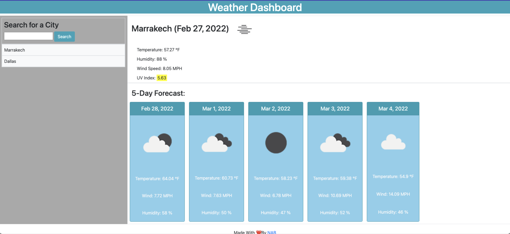

# Weather-Dashboard

Description:

   Third-party APIs allow developers to access their data and functionality by making requests with specific parameters to a URL. Developers are often tasked with retrieving data from another application's API and using it in the context of their own.
   A great web application that allows users to search for a city to get the current weather with a 5 day forecast. Cities that users previously looked up will be saved in their local storage.

User Story:

    AS A traveler;
    I WANT to see the weather outlook for multiple cities
    SO THAT I can plan a trip accordingly.

 Acceptance Criteria:

- GIVEN a weather dashboard with form inputs;

-WHEN I search for a city
-THEN I am presented with current and future conditions for that city and that city is added to the search history.

-WHEN I view current weather conditions for that city
-THEN I am presented with the city name, the date, an icon representation of weather conditions, the temperature, the humidity, the wind speed, and the UV index.

-WHEN I view the UV index
-THEN I am presented with a color that indicates whether the conditions are favorable, moderate, or severe.

-WHEN I view future weather conditions for that city
-THEN I am presented with a 5-day forecast that displays the date, an icon representation of weather conditions, the temperature, the wind speed, and the humidity.

-WHEN I click on a city in the search history
-THEN I am again presented with current and future conditions for that city.
   

Mock-Up:

Technologies Used:

HTML
CSS
OpenWeather API
Bootstrap

The URL of the functional and deployed application: 
https://nehailaa.github.io/Weather-Dashboard/

The URL of the GitHub repository:
https://github.com/Nehailaa/Weather-Dashboard

  ## Additional Information
  ✉️` Contact me with any questions`: [Email](mailto:nehailakarmel@gmail.com) , [GitHub](https://github.com/Nehailaa) 

Made with ♥️ 
* NAB *